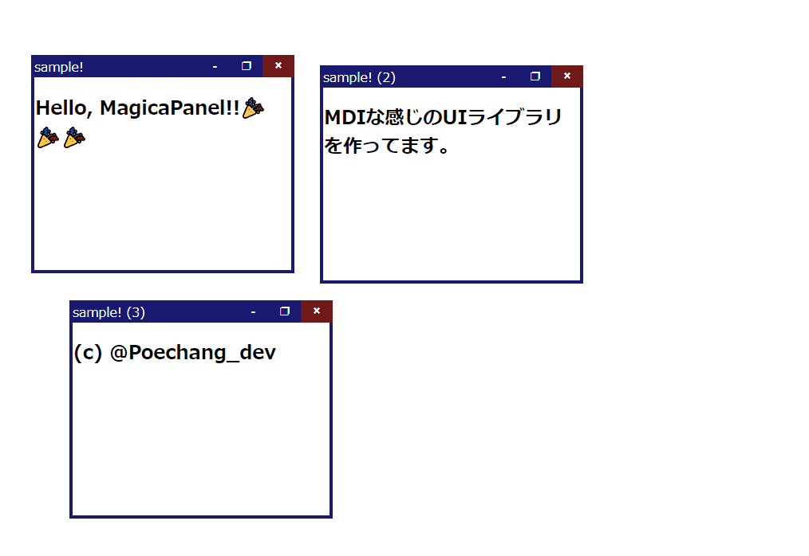

===

MagicaPanel は MDI ( Multiple Document Interface ) ライクに HTML を複数の ウィンドウ領域に分割して表示できるUIライブラリです。



使用方法
---

MagicaPanelをインストールするコマンドを以下に記...
そうと思いましたが、`npm`に`publish`したら書きます。

### ライブラリ利用方法 ###

MagicaPanelが提供する各クラスは以下のコンストラクタ引数を取ります。

1. 自身を表示する`HTMLElement`(`BaseContainer` のみ)
2. オプション
3. (以降) 自身の中に表示する子要素

また、各ウィンドウやその整列は一番上の親に`BaseContainer`クラスのインスタンスが配置される構造にならなければなりません。

以下サンプル

```javascript
    // 一番親は`BaseContainer`である必要があります。
    new MagicaPanel.BaseContainer(
        document.body,
        {overflowX: 'hidden', overflowY: 'hidden'},
        // `StackContainer`には子アイテムを整列表示することが出来ます。
        new MagicaPanel.StackContainer(
            undefined, // オプションを与えなかった場合、各クラスの既定が採用されます。
            // `Panel`は`StackContainer`の子要素として整列表示されます。
            // `Panel`が唯一純粋なHTMLElementを子要素に持つことが出来ます。
            //     (`StackContainer`を持つことも出来ます。)
            new MagicaPanel.Panel(
                {title: 'stack-sample!'},
                document.createElement('div')
            ),
            new MagicaPanel.Panel(
                {title: 'stack-sample!'},
                document.createElement('div')
            )
        ),
        // `Panel`は`StackContainer`に含まれないため、ウィンドウとしてフロー表示されます。
        new MagicaPanel.Panel(
            {title: 'window-sample!'},
            document.createElement('div')
        )
    );
```

ドキュメント
---

### クラス ###

- `Panel`: ウィンドウとしての表示やスタックコンテナの要素として利用できます。子要素には`HTMLElement`または`StackContainer`を1つのみ格納できます。
    - コンストラクタ引数
        - opts: `PanelOptions`
        - ...children: `HTMLElement | StackContainer`
- `StackContainer`: `Panel`を縦または横に整列する枠として利用できます。子要素には`Panel`または`StackContainer`を複数格納できます。
    - コンストラクタ引数
        - opts: `StackContainerOptions`
        - ...children: `[Panel | StackContainer]`
- `BaseContainer`: `Panel`や`StackContainer`を格納する一番親として1つのみ存在します。子要素には複数の`Panel`と、1つのみ`StackContainer`できます。
    - コンストラクタ引数
        - opts: `BaseContainerOptions`
        - ...children: `[StackContainer?, ...Panel]`

### オプション ###

#### `PanelOptions` ####

| プロパティ名           | 型                                   | 説明                                                 |
|-----------------------|--------------------------------------|-----------------------------------------------------|
| `type`                | `'panel'`                            | パネル種別                                           |
| `minSize`             | `CoordinationOptions`                | 最小ウィンドウ内コンテンツサイズ(指定があれば)          |
| `maxSize`             | `CoordinationOptions`                | 最大ウィンドウ内コンテンツサイズ(指定があれば)          |
| `position`            | `CoordinationOptions`                | 初期位置(左上)                                       |
| `defaultSize`         | `CoordinationOptions`                | 初期サイズ(320x240, タイトルバー、ウィンドウ枠線含まず) |
| `title`               | `string \| HTMLElement`              | タイトル                                             |
| `closeable`           | `boolean`                            | バツボタンを出現させる                                |
| `minimable`           | `boolean`                            | 最小化ボタンを出現させる                              |
| `maximum`             | `ResizeableOptions`                  | 最大化の挙動                                         |
| `modal`               | `'modal' \| 'modaless' \| 'topMost'` | モーダル表示状態                                     |
| `overflowX`           | `'scroll' \| 'resize' \| 'hidden'`   | 内容コンテンツがX軸に溢れた場合                       |
| `overflowY`           | `'scroll' \| 'resize' \| 'hidden'`   | 内容コンテンツがY軸に溢れた場合                       |
| `additionalClassName` | `string`                             | パネルに追加で付けるクラス名                          |
| `attributes`          | `any[]`                              | 任意に指定できる属性                                  |

#### `CoordinationOptions` ####

| プロパティ名 | 型       | 説明  |
|-------------|----------|-------|
| `x`         | `number` | X方向 |
| `y`         | `number` | Y方向 |

#### `ResizeableOptions` ####

| プロパティ名    | 型        | 説明                           |
|----------------|-----------|-------------------------------|
| `enable`       | `boolean` | ユーザ操作の有効・無効          |
| `showTitlebar` | `boolean` | 適用時にタイトルバーを表示するか |

#### `StackContainerOptions` ####

| プロパティ名           | 型                          | 説明                           |
|-----------------------|-----------------------------|-------------------------------|
| `type`                | `'stack'`                   | パネル種別 |
| `direction`           | `'vertical' \| 'horizontal'`| 分割方向 |
| `template`            | `string[]`                  | コレクション各要素の初期サイズ |
| `reproportionable`    | `boolean`                   | コレクションの比率を操作できるか |
| `dockable`            | `boolean`                   | コレクションの脱着操作ができるか(ユーザ操作から) |
| `separatorWidth`      | `number`                    | 分割境界線の幅(1～) |
| `additionalClassName` | `string`                    | パネルに追加で付けるクラス名 |
| `panelAddArea`        | `string \| HTMLElement`     | スタック内が空のときに表示されるパネル追加アイコン |
| `attributes`          | `any[]`                     | 任意に指定できる属性 |
| `adjustSize`          | `boolean`                   | 

#### `BaseContainerOptions` ####

| プロパティ名            | 型                    | 説明                           |
|------------------------|-----------------------|-------------------------------|
| `type`                 | `'base'`              | パネル種別                     |
| `overflowX`            | `'scroll' \| 'hidden'`| 内容コンテンツがX軸に溢れた場合  |
| `overflowY`            | `'scroll' \| 'hidden'`| 内容コンテンツがY軸に溢れた場合  |
| `additionalClassNames` | `string[]`            | パネルに追加で付けるクラス名     |
